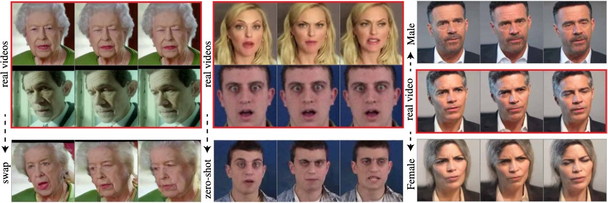
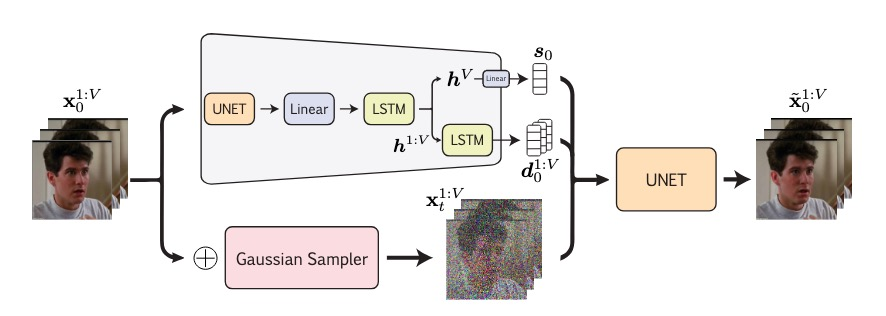

# DiffSDA: Unsupervised Diffusion Sequential Disentanglement Across Modalities

**Hedi Zisling**, **Ilan Naiman**, **Nimrod Berman**, **Supasorn Suwajanakorn**, **Omri Azencot**

---

## 📢 News
*   **[Feb 2026]** 🎉 Accepted to **ICLR 2026**!
*   **[Oct 2025]** Paper released on arXiv.

---

## 🖼️ Teaser

  

## 📄 Abstract

Unsupervised representation learning, particularly sequential disentanglement, aims to separate static and dynamic factors of variation in data without relying on labels. This remains a challenging problem, as existing approaches based on variational autoencoders and generative adversarial networks often rely on multiple loss terms, complicating the optimization process. Furthermore, sequential disentanglement methods face challenges when applied to real-world data, and there is currently no established evaluation protocol for assessing their performance in such settings. Recently, diffusion models have emerged as state-of-the-art generative models, but no theoretical formalization exists for their application to sequential disentanglement. In this work, we introduce the Diffusion Sequential Disentanglement Autoencoder (DiffSDA), a novel, modal-agnostic framework effective across diverse real-world data modalities, including time series, video, and audio. DiffSDA leverages a new probabilistic modeling, latent diffusion, and efficient samplers, while incorporating a challenging evaluation protocol for rigorous testing. Our experiments on diverse real-world benchmarks demonstrate that DiffSDA outperforms recent state-of-the-art methods in sequential disentanglement.

## 🏗️ Method

  

## 💻 Code

The code will be published soon.
